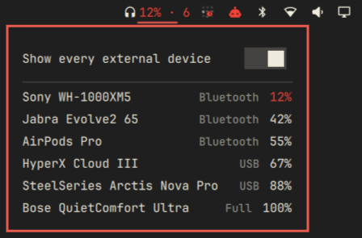

# omajuice

Your headset's battery, right there in the Omarchy bar.



Wireless headsets are good at hiding how much charge they have left, usually
until the moment they die mid-call. omajuice puts the number in your bar, turns
it red when it gets low, and tells you before it becomes your problem.

- **The level, always visible.** The lowest battery among your matched devices,
  in the bar, next to everything else you already watch.
- **A panel with the details.** Every matched device with its charge, its state
  and whether it came in over Bluetooth or USB. Lowest first, because that is
  the one you care about.
- **It tells you when it matters.** Low battery, fully charged, and optionally
  when a device drops off.
- **Nothing running in the background.** No daemon, no helper process, no
  compiled dependency. It reads what your system already knows.

## Requirements

Omarchy 4 or later.

## Coming from HeadsetStatus?

On Omarchy 4, omajuice is the one to use. It replaces
[HeadsetStatus](https://github.com/mewset/headsetstatus) and is the preferred
choice there: nothing to compile, nothing running in the background, and your
devices are recognised the same way they always were.

HeadsetStatus stays where it is for setups that have not moved to Omarchy 4.

## Install

```bash
omarchy plugin add https://github.com/mewset/omajuice.git --enable
```

Then add the widget to your bar from `Setup > Plugins`.

## Settings

| Setting | Default | What it does |
|---|---|---|
| Show every external device | Off | Also lists mice, keyboards and controllers |
| Low battery threshold | 20% | When the low battery warning fires |
| Notify on low battery | On | |
| Notify when fully charged | On | |
| Notify on disconnect | Off | Bluetooth devices drop off on every suspend, so this one is noisy |
| Hide when no device is found | On | Removes the bar item when there is nothing to show |

## Not seeing your headset?

Some devices do not tell the system what they are. Turn on **Show every
external device** and it will list everything with a battery, headset or not.

If that finds it, open an issue with the device name so it can be recognised
properly next time.

## Good to know

**Changing a setting will not set off a warning.** If you raise the threshold
above a device that is already below it, or reveal a device that is already
low, omajuice stays quiet — a setting you changed is not something that
happened to your battery. That device gets its warning the next time it
genuinely drops, after recovering first.

**If you use a replacement bar,** one that takes the place of Omarchy's own,
the widget cannot reach its data and will show nothing at all. Nothing breaks,
but there is nothing to see either.

## Licence

MIT
